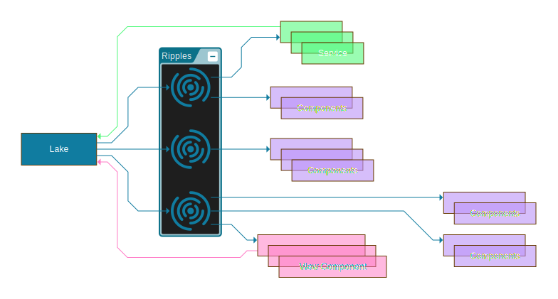

## What is Ripple ?

Ripple is a state management library for React. It's a simple and powerful alternative to Redux / Recoil / MobX...

Create a ripple with an initial state, and use it in your components. Keep the logic in the component or in a service, it's up to you.

No need for any subscription, Ripple will render your component in case of any change. Even from a service, it will not break the hook lifecycle.

***It is just easy pizy lemon squeezy !!***

### Documentation : [Here](https://ripple.m-c2.dev)